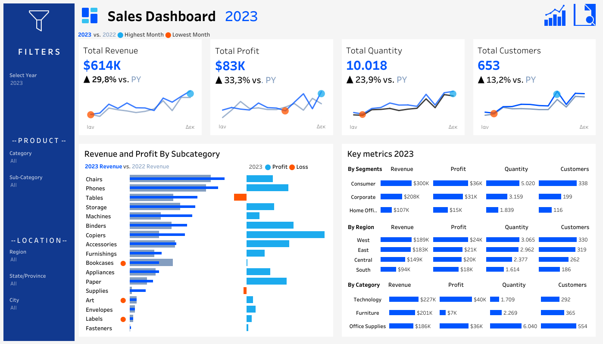
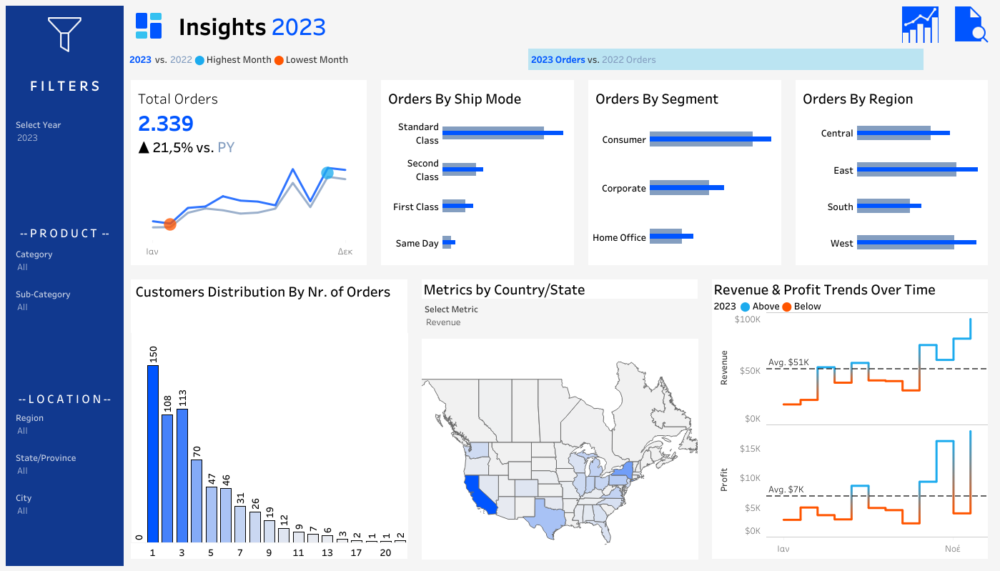

# 🏪 Superstore Project  

## Info-Data

The well-known Superstore dataset from Tableau. This is one of my many attempts with this dataset—mainly for practice and experimenting while learning Tableau. It’s also my latest version and the one I believe is my best so far. I have to mention here the very valuable insights from [Barra’s](https://www.youtube.com/@DataWithBaraa) videos about Tableau.

## Key Takeaways

I tried to keep it simple—basic charts, KPIs, and maps.
- This project includes two dashboards. The first focuses mainly on Revenue and Profit, while the second provides insights into Orders and time trends.
- Time trends show an increase in every second half of the year for each of the four years in the dataset.
- The West region (mainly California) leads in every category: Revenue, Profit, Quantity, Customers, and Orders.
- The same applies to the Consumer segment, which ranks first in every category.
- Standard Class is by far the most used ship mode..
- Total Revenue, Profit, Quantity, and Customers increase almost every year compared to the previous one.

## 📊 Dashboards

🔗 [Tableau Link](https://public.tableau.com/app/profile/theodoros.malezidis7413/viz/SuperStoreDashboard_17390157300450/SalesDashboard)

- Sales Dashboard

- Insights Dashboard

